# Kayla's Garden

Kayla's Garden is now a single-file Python `customtkinter` desktop runtime centered on local-first plant intelligence.

The core app lives in [main.py](./main.py). It tracks plant passports, observations, health records, diagnosis notes, shared techniques, LiteRT-LM prompt flows, encrypted local storage, optional IPFS publishing, optional Hive checkpoint preparation, and optional OQS post-quantum guidance.

Azure has been removed.

## What It Does

- Local-first plant passports with notes, care profile fields, tags, and coarse GeoPetal proofs
- Observation capture with GPS, image tagging, plant profile updates, and encrypted LeafVault storage
- LiteRT-LM prompt flows for:
  - observation analysis
  - care briefs
  - Chat With A Plant
  - plant problem diagnosis
  - health check-ins
- Gemma 4 vision-ready chat flow that can use:
  - a newly selected plant image
  - or a decrypted historical plant image from the local vault when available
- Shared technique cards that can be queued for IPFS/Hive-style replication
- Managed Kubo/IPFS daemon controls that stay off until users explicitly enable them
- Garden insights including a watchlist, activity timeline, and greenhouse digest
- Encrypted AES-GCM network secret storage for IPFS and Hive identities
- Community pin groups, comments, and peer co-pin requests for faster IPFS access
- Local-first by default, with cloud mode explicitly opt-in
- Optional IPFS Kubo HTTPX client
- Optional Hive JSON-RPC checkpoint preparation
- Optional OQS advisory, repo references, build script, and requirements file

## Runtime Modes

### Local-first

Default mode. Everything works without network services:

- encrypted local storage
- synthetic CIDs when IPFS is off
- prepared Hive checkpoint payloads without broadcast
- local sync queue files
- heuristic fallbacks when LiteRT-LM is unavailable

### Cloud mode

Cloud behavior is off until you enable it in the app or settings:

- `network_mode = "cloud"`
- `cloud_mode = true`
- `ipfs_enabled = true` to activate Kubo RPC publishing
- `hive_enabled = true` to prepare Hive network checkpoints
- `hive_broadcast_enabled = true` only when you have a real signing/broadcast path

## Main Features

### Plant Passports

Each plant gets a passport with:

- plant name and species
- hardiness zone
- privacy class
- profile summary
- sunlight, watering, and soil guidance
- tags
- observation timeline

### Observation Studio

An observation can include:

- note text
- GPS coordinates
- plant image
- manual tags

The runtime then:

1. derives a GeoPetal proof
2. runs prompt-driven plant analysis
3. updates the plant profile
4. seals JSON and image assets into LeafVault
5. assigns a CID or synthetic CID
6. prepares a Hive checkpoint payload
7. queues a RootMesh sync job

### Chat With A Plant

The Guide tab and `plant-guide` CLI command create a long-context plant-specific response using:

- the plant passport
- observation history
- health check-ins
- shared techniques
- historical image inventory
- an optional current image
- or a prior decrypted plant image when one exists

This flow is designed for Gemma 4 vision through LiteRT-LM, with a local fallback when the model is missing.

### Plant Diagnosis

The Care Lab can create a diagnosis record that includes:

- urgency
- likely causes
- care actions
- prevention tips
- narrative analysis
- encrypted metadata asset
- prepared Hive checkpoint payload

### Health Check-Ins

Health check-ins create revisit-friendly records with:

- overall status
- vigor score
- hydration score
- pest and disease pressure
- action items
- narrative summary

### Shared Techniques

Technique cards let users record reusable plant knowledge:

- title
- plant scope
- problem focus
- summary
- step list
- tags
- privacy class

These are stored locally first and can be queued for IPFS/Hive style distribution when cloud mode is enabled.

### Encrypted Network Vault

The Settings tab now includes an AES-GCM secret vault for sensitive network identity material such as:

- IPFS user id
- pin surface or pinning service label
- pin surface token / bearer token
- Hive username
- Hive posting key

These are stored separately from plain runtime settings in an encrypted file and are masked in status views.

### Community Pin Surface

The Community tab lets growers build a cooperative plant network with:

- active peer plant users
- shared pin groups
- group comments
- peer co-pin requests for specific CIDs

That gives the app a local-first collaboration surface for asking peers to keep important plant timelines warm and easier to fetch over IPFS.

### Insights Workboard

The Insights tab adds a higher-level garden operations view with:

- a plant watchlist ranked by current priority
- a cross-plant activity timeline
- a greenhouse digest that combines care signals with infrastructure state

### Managed IPFS Daemon

The Settings tab can manage a local Kubo daemon, but only after the user explicitly enables it.

That managed path includes:

- optional managed binary installation
- optional repo initialization
- start and stop controls
- persistent repo and log paths inside the runtime root
- daemon status reporting without forcing cloud mode on

## Storage Model

The runtime creates a self-contained storage root:

- encrypted vault state
- settings file
- model cache
- encrypted LeafVault assets
- anchor queue files
- sync queue files

By default, the desktop app uses:

```text
.kaylas-garden-runtime/
```

You can point commands at another root with `--root`.

## Requirements

Minimum:

- Python 3.11+

Recommended local modules:

- `customtkinter`
- `httpx`
- `cryptography`

Optional local AI / security modules:

- LiteRT-LM runtime compatible with the Gemma 4 LiteRT model
- `oqs` / `liboqs-python`

The runtime degrades gracefully if some optional modules are missing.

## Running The App

Launch the desktop app:

```bash
python3 main.py
```

Use a custom runtime root:

```bash
python3 main.py --root /tmp/kaylas-garden-dev
```

## Screen Walkthrough

### screen1

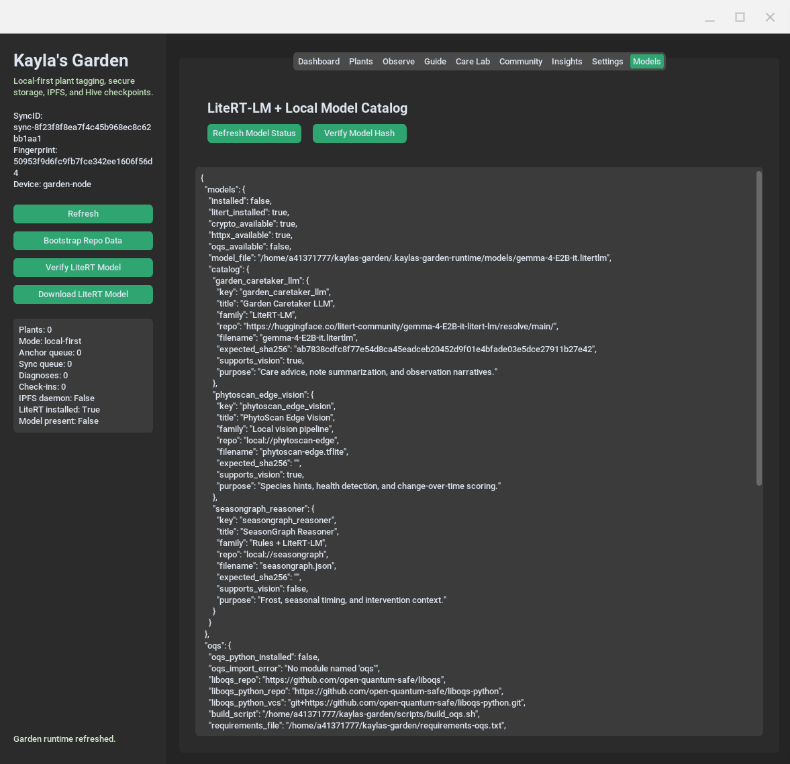

`screen1` is the Dashboard.

This is the control-room view for the garden:

- garden summary
- queue depth
- sync identity snapshot
- quick status of local-first, model, and network subsystems

### screen2

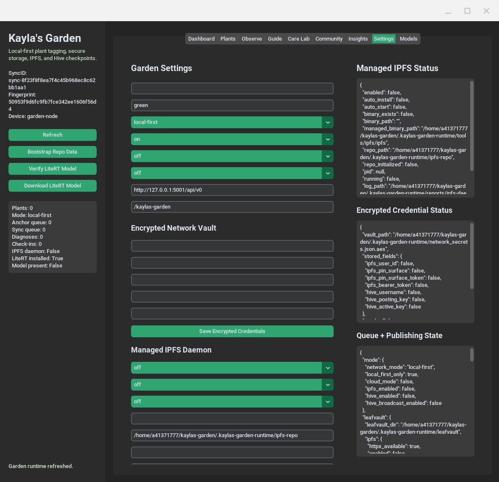

`screen2` is Plants.

This is where users create and review plant passports:

- plant name and species
- hardiness zone
- privacy class
- care profile summary
- latest status and observation count

### screen3

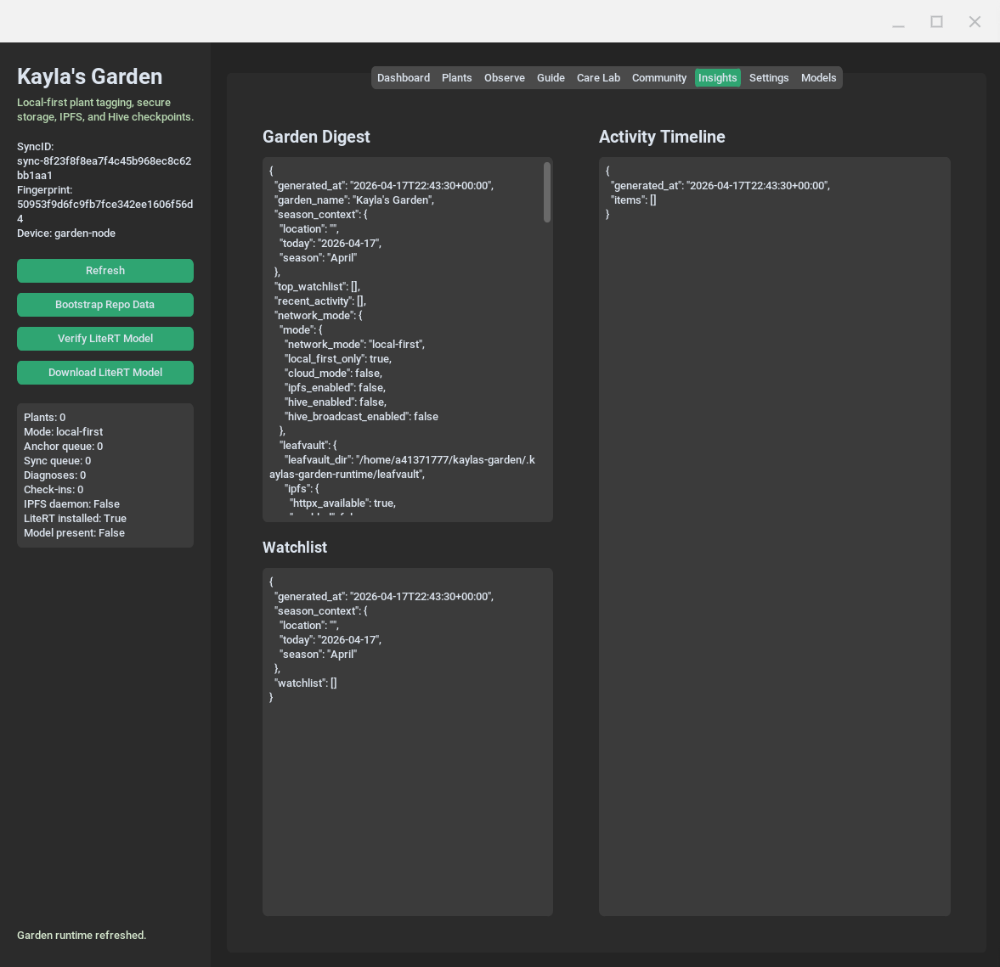

`screen3` is Observe.

This is the ingestion point for new plant evidence:

- note entry
- GPS capture
- image selection
- manual tags
- plant profile refresh
- LeafVault storage and checkpoint queueing

### screen4

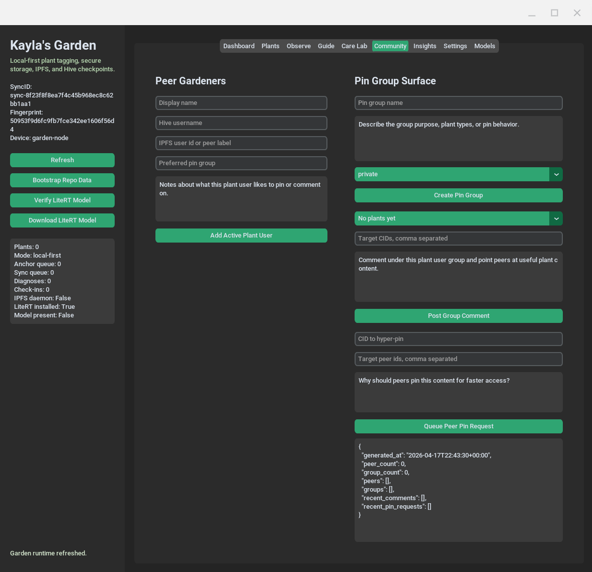

`screen4` is Guide.

This is the long-context "Chat With A Plant" surface:

- uses plant passport data
- uses prior observations
- uses health check-ins
- uses shared techniques
- can compare with current or historical plant images

### screen5

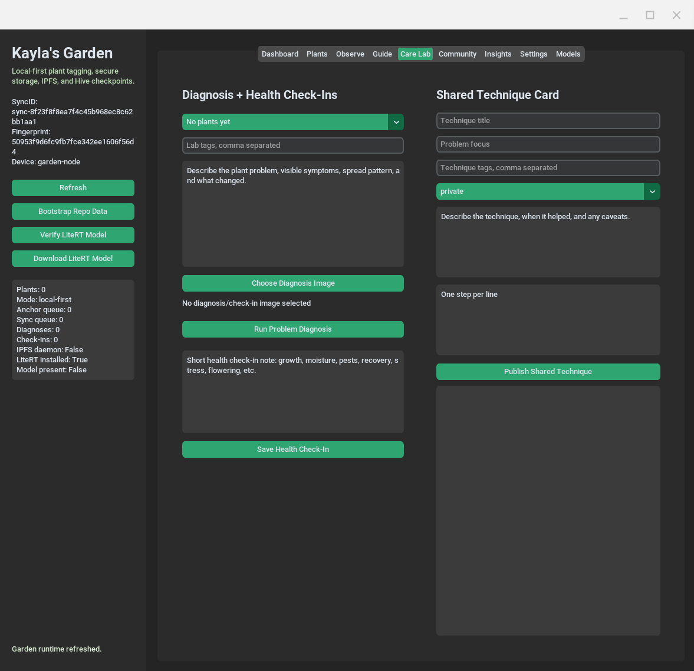

`screen5` is Care Lab.

This is the structured plant intervention workspace:

- diagnosis runs
- health check-ins
- shared technique publishing
- queue-aware local-first sync output

### screen6

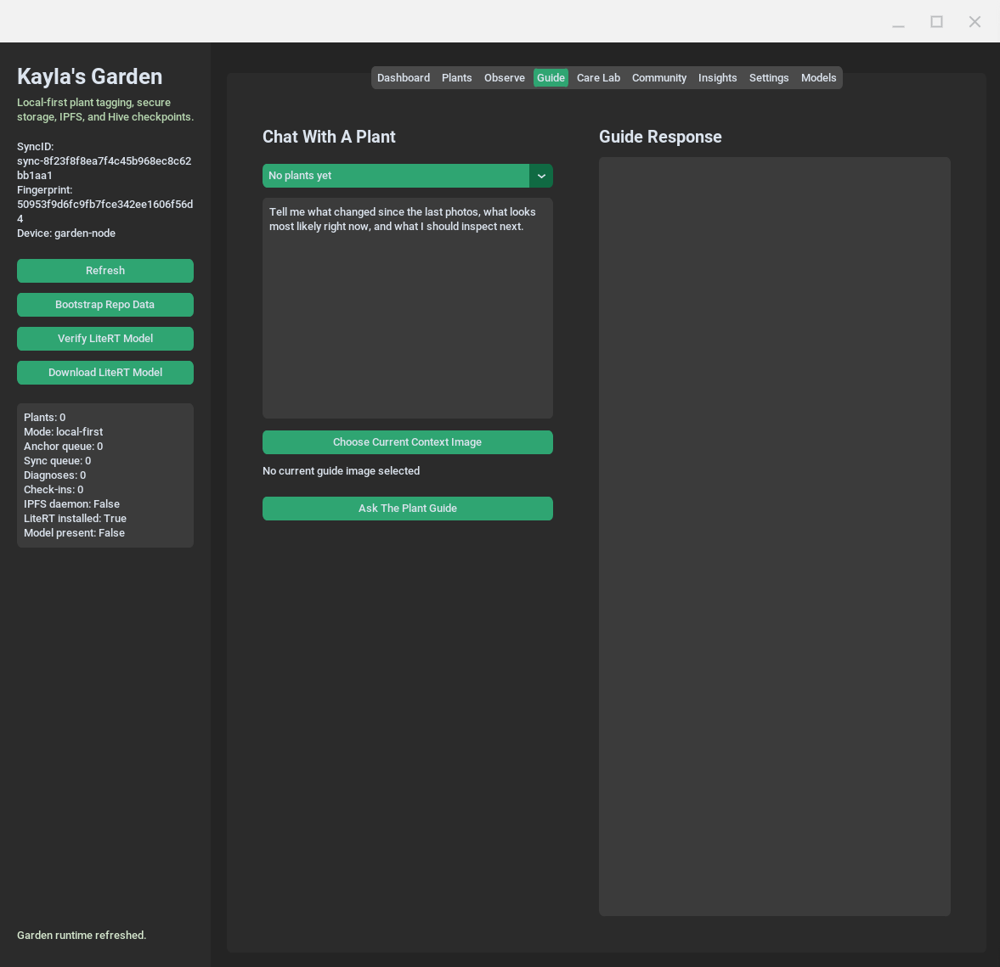

`screen6` is Community.

This is the cooperative plant-user and pin-group surface:

- active peer plant users
- pin groups
- group comments
- peer co-pin requests
- local-first metadata publishing for shared plant access

### screen7

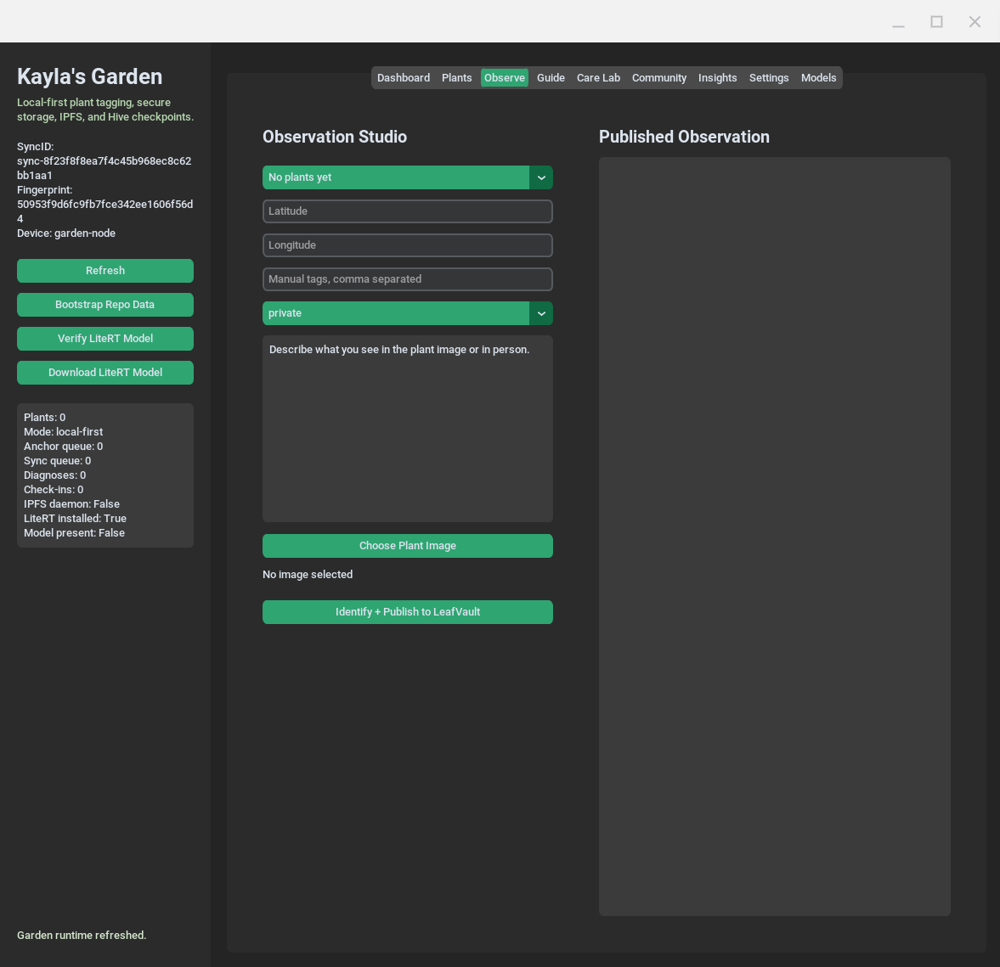

`screen7` is Insights.

This is the operational intelligence workboard:

- watchlist ranking
- recent activity timeline
- greenhouse digest
- cross-plant triage view

### screen8

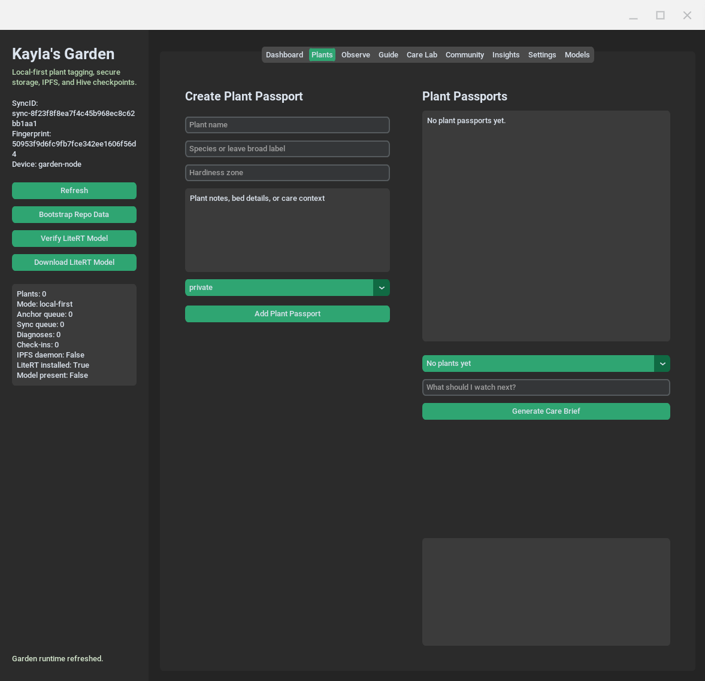

`screen8` is Settings.

This is where the secure transport and daemon controls live:

- encrypted AES-GCM network vault
- IPFS user id and pin surface credentials
- Hive username and posting key storage
- managed Kubo install, start, and stop controls
- cloud-mode gating

### screen9

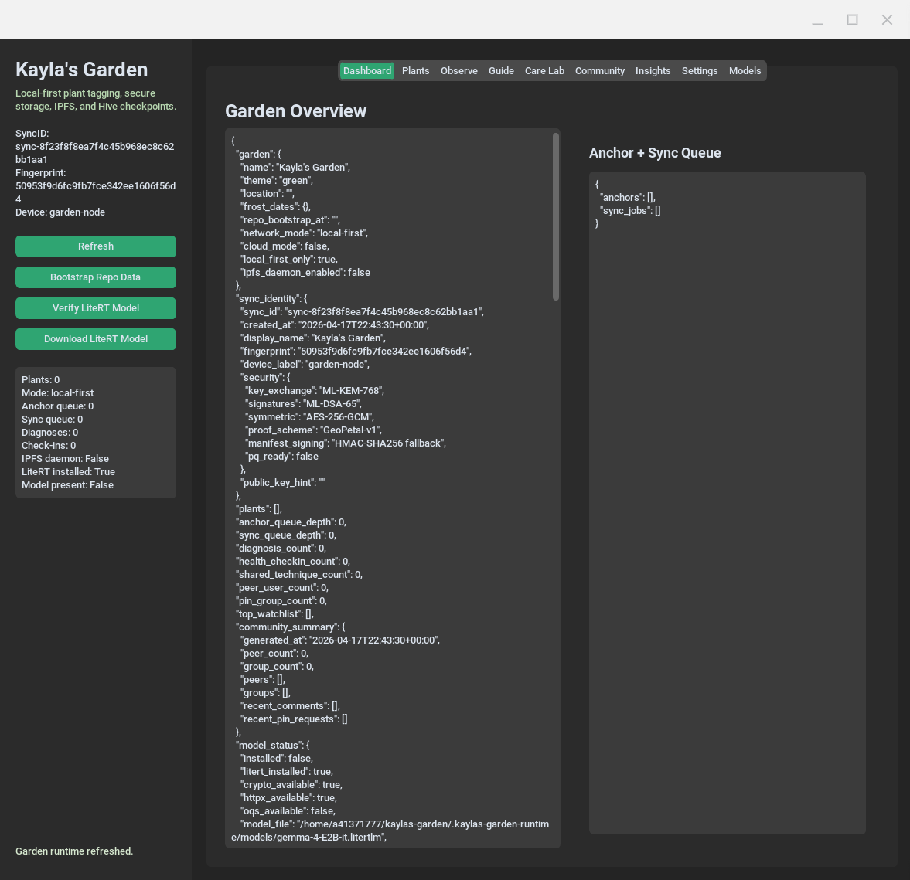

`screen9` is Models.

This is the local AI operations panel:

- LiteRT-LM status
- Gemma 4 model verification
- model download state
- OQS status visibility

## How It Works

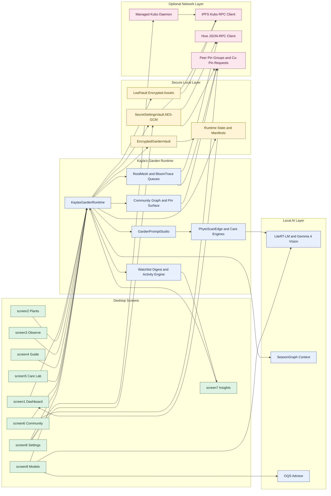

## Design Goals

Kayla's Garden is trying to solve a specific class of problem:

- plant care data is longitudinal rather than transactional
- plant evidence is multimodal rather than text-only
- growers need local privacy and local speed
- community stewardship matters for plants that outlive any one device or one person
- the system should still produce useful output when cloud services disappear

The design goals are therefore:

1. local-first before cloud-first
2. encrypted by default for private garden state
3. image-aware rather than text-only
4. append-friendly rather than overwrite-heavy
5. explainable enough for a gardener, but structured enough for future research workflows
6. resilient enough that IPFS, Hive, LiteRT-LM, or OQS can be missing and the app still works

## Conceptual Model

At a high level, the system treats each plant as a persistent living record:

$$
P = \{M, O_{1..n}, D_{1..m}, C_{1..k}, T_{1..r}\}
$$

Where:

- $M$ is the plant passport metadata
- $O$ is the ordered set of observations
- $D$ is the ordered set of diagnosis records
- $C$ is the ordered set of health check-ins
- $T$ is the ordered set of shared technique cards

The runtime is effectively building a local case file for each plant instead of a one-shot AI answer.

Each observation can be thought of as:

$$
O_t = (I_t, N_t, G_t, H_t, \tau_t, A_t)
$$

Where:

- $I_t$ is image evidence when available
- $N_t$ is the gardener note
- $G_t$ is the coarse GeoPetal proof
- $H_t$ is the heuristic or model-derived health packet
- $\tau_t$ is the timestamp
- $A_t$ is the encrypted asset bundle and metadata CID

That means every new observation is not just content, but a state transition in the plant's recorded history.

## Mathematical View

The current runtime uses a practical heuristic implementation, but the conceptual model can be described more formally.

### 1. Health Packet

Let:

- $v$ be vigor
- $s$ be stress risk
- $p$ be pest risk
- $d$ be disease risk

Then the health packet is:

$$
H = (v, s, p, d, c)
$$

Where $c$ is confidence.

The current runtime behaves roughly like:

$$
v \in [0.05, 0.99], \quad s,p,d \in [0.01, 0.99]
$$

and modifies those values based on note cues such as:

- yellowing
- wilting
- pests
- mildew
- flowering

Conceptually, a more advanced future model would compute:

$$
H_t = f_\theta(I_t, N_t, M, O_{<t}, C_{<t}, S_t)
$$

Where:

- $f_\theta$ is the local multimodal inference function
- $S_t$ is seasonal context

### 2. Watchlist Priority

The runtime already computes a watchlist score heuristically. A more formal reading is:

$$
W(P) = \alpha \cdot R_o + \beta \cdot R_d + \gamma \cdot R_c + \delta \cdot R_g
$$

Where:

- $R_o$ is observation urgency
- $R_d$ is diagnosis urgency
- $R_c$ is check-in urgency
- $R_g$ is missing-ground-truth penalty such as absent geoproof or missing history

In the current app, this is implemented as a weighted additive heuristic. In a future version, the weights could be learned from outcomes.

### 3. GeoPetal Proof

The current coarse location proof is effectively:

$$
L' = round(L, q)
$$

Where:

- $L$ is the original latitude / longitude pair
- $q$ is the quantization level implied by the precision target

Then the region hash is:

$$
R = SHA256("geopetal:" \parallel precision \parallel coarse\_label)
$$

This creates a region-level anchor without exposing exact garden coordinates.

### 4. Encrypted Asset Storage

Every stored object can be represented as:

$$
E = AESGCM_K(payload)
$$

and the content identity is anchored through:

$$
CID_{local} =
\begin{cases}
CID_{ipfs} & \text{if IPFS is enabled and reachable} \\
synthetic\_CID(SHA256(payload)) & \text{otherwise}
\end{cases}
$$

This matters because the plant record remains internally referentially stable even when the external network path is unavailable.

### 5. Community Pin Utility

The community system introduces the idea that some CIDs are more valuable to replicate than others.

A future formal co-pin utility could be:

$$
U(c) = \lambda_1 A(c) + \lambda_2 R(c) + \lambda_3 H(c) + \lambda_4 C(c)
$$

Where:

- $A(c)$ is access frequency
- $R(c)$ is rarity or irreplaceability
- $H(c)$ is historical significance
- $C(c)$ is community demand

The current implementation does not yet optimize by this score, but the community pin-request workflow is laying the data path for it.

## Runtime Semantics

The app behaves like a local event system.

The typical event chain is:

1. a gardener creates a plant passport
2. a new observation is captured
3. the runtime derives tags and health heuristics
4. LiteRT-LM may synthesize a richer explanation
5. the payload is encrypted into LeafVault
6. the metadata is assigned a CID or synthetic CID
7. a BloomTrace checkpoint payload is prepared
8. a RootMesh sync job is queued
9. optional community surfaces can reference the result later

This means the runtime separates:

- data capture
- local reasoning
- encryption
- replication intent
- optional broadcast

That separation is one of the core architectural choices in the project.

## Operational Pipeline

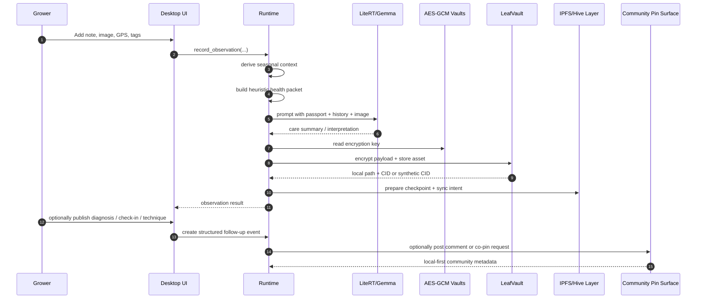

## Security Model

There are two main encrypted surfaces:

### 1. Garden State Vault

This stores:

- plant passports
- observations
- diagnosis records
- check-ins
- techniques
- queues
- runtime graph state

Conceptually:

$$
V_{garden} = AESGCM_{K_g}(json\_state)
$$

### 2. Network Secret Vault

This stores:

- IPFS user id
- pin surface token
- Hive username
- Hive posting key

Conceptually:

$$
V_{secret} = AESGCM_{K_g}(json\_secrets)
$$

The same root local key currently underlies both, but the secrets are stored in a separate encrypted file so they are not mixed with ordinary user-facing settings.

### Key Handling

The local key is either:

- randomly generated and stored locally
- or password-protected through a wrapped form

Conceptually, the password-protected path is:

$$
K_w = Scrypt(password, salt)
$$

$$
blob = AESGCM_{K_w}(K_g)
$$

So the password is not used directly for garden payload encryption. It protects the local garden key.

## Trust And Privacy

Kayla's Garden deliberately avoids exact-location-first logic.

The privacy stance is:

- exact GPS may be used transiently for proof construction
- the stored public-facing geography is coarse
- private garden state remains encrypted locally first
- public or shared replication is an explicit act, not the default

This is especially important for:

- home gardens
- rare plant locations
- heirloom propagation
- public-tree stewardship with sensitive coordinates

## Why IPFS Fits This Problem

Plant data is unusually well-suited to content-addressed storage because:

- image histories grow over time
- the same material may be useful to multiple gardeners
- many records are append-heavy and seldom rewritten
- some plant timelines should survive beyond a single app instance

Conceptually, if a plant history contains assets:

$$
\mathcal{A}_P = \{a_1, a_2, ..., a_n\}
$$

then IPFS-style addressing makes each asset stable by content rather than by path:

$$
id(a_i) = hash(a_i)
$$

That makes long-lived replication and cross-user reference much more natural than a traditional centralized file path model.

## Why Hive Fits This Problem

Hive is not being used here as a heavy database. It is closer to a public witness layer.

The intended role is:

- checkpoint proofs
- comment publication
- shared public summaries
- lightweight social coordination around plants and pin groups

This is a better fit than forcing every private plant datum on-chain. Most of the real plant state belongs in encrypted local or replicated content storage, not in a public ledger.

## Explainability Layer

One of the most important design decisions in the app is that LLM output is not treated as the plant record itself.

Instead, LLM output is one layer in a larger stack:

$$
Plant\ Understanding = Evidence + History + Season + Heuristics + Model\ Narrative
$$

More explicitly:

$$
U_t = g(I_t, N_t, O_{<t}, C_{<t}, T_{<t}, S_t)
$$

Where the model-generated narrative is only one term in the function, not the entire function.

That makes it easier to build safer and more auditable plant assistance over time.

## Failure Modes

The runtime is intentionally designed around graceful degradation.

### If LiteRT-LM is unavailable

- heuristic summaries still work
- plant records still store normally
- queue and vault features still work

### If `httpx` is unavailable

- network clients stay inactive
- synthetic CIDs are used
- queue files still accumulate locally

### If Kubo is disabled or absent

- the managed daemon surface stays informational
- encrypted local object storage continues to work

### If Hive broadcast is not available

- prepared posting operations can still be generated
- the local queue still captures intent and metadata

This is not accidental. It is a core product philosophy.

## Current Implementation Versus Future System

There are two layers to understand when reading this repo.

### What exists now

- single-file Python desktop runtime
- local encrypted state
- local encrypted secret vault
- prompt-driven plant guidance
- community metadata and co-pin request queues
- optional managed Kubo path
- optional IPFS RPC path
- optional Hive JSON-RPC preparation path

### What is clearly scaffolded but not fully complete yet

- real signed Hive broadcasting using the stored posting key
- stronger multi-peer replication economics
- automatic community pin optimization
- learned watchlist scoring from outcomes
- richer multimodal temporal differencing between plant images

## Research Directions

This project can evolve in at least four directions.

### 1. Personal Garden Intelligence

The app becomes a private memory system for one grower:

- what happened
- when it happened
- what changed
- what worked

### 2. Cooperative Stewardship Network

The app becomes a community layer for:

- shared trees
- neighborhood gardens
- pollinator corridors
- school and civic plantings

### 3. Ecological Archive

The system becomes a durable archive of plant histories:

- images
- stress timelines
- recovery patterns
- stewardship knowledge

### 4. Field Research Runtime

With tighter schema control and stronger export tools, the same runtime could support:

- small-scale agronomy studies
- local ecological surveys
- restoration tracking
- citizen science plant datasets

## Product Philosophy

Kayla's Garden is not trying to be just another plant app with a chatbot pasted on top.

The deeper idea is:

- each plant becomes a case file
- each garden becomes a local intelligence node
- each community becomes an optional replication and stewardship mesh
- each model answer becomes one interpretable layer inside a broader evidence system

That is a much more durable direction than building yet another cloud-only plant question-answering app.

## Useful CLI Commands

Bootstrap repo data into the encrypted runtime:

```bash
python3 main.py bootstrap
```

Create a plant passport:

```bash
python3 main.py add-plant --name "Rosemary Pot" --species "Salvia rosmarinus"
```

Record an observation:

```bash
python3 main.py observe \
  --plant-id <plant-id> \
  --note "Aphids on the top shoots and the new growth is curling." \
  --lat 42.36 \
  --lon -71.05 \
  --image /path/to/plant.jpg \
  --tags aphids,deck
```

Generate a care brief:

```bash
python3 main.py care-brief --plant-id <plant-id> --question "What should I watch next?"
```

Chat with a plant:

```bash
python3 main.py plant-guide \
  --plant-id <plant-id> \
  --question "Compare this week to prior plant photos and tell me what changed."
```

Run a diagnosis:

```bash
python3 main.py diagnose \
  --plant-id <plant-id> \
  --note "Lower leaves are yellowing and the soil stays wet for days." \
  --tags yellowing,wet-soil
```

Save a health check-in:

```bash
python3 main.py health-checkin \
  --plant-id <plant-id> \
  --note "New growth looks better, but the root zone still dries slowly."
```

Publish a technique card:

```bash
python3 main.py share-technique \
  --plant-id <plant-id> \
  --title "Let rosemary dry a bit deeper" \
  --problem-focus "Wet roots in containers" \
  --summary "Waiting for the pot to lighten reduced stress." \
  --steps "Check pot weight|Check moisture below the surface|Water deeply only when the pot lightens" \
  --tags rosemary,watering \
  --privacy shared
```

Check network and OQS state:

```bash
python3 main.py network-status
python3 main.py secret-status
python3 main.py ipfs-daemon-status
python3 main.py oqs-status
python3 main.py oqs-search --query ML
```

Garden operations views:

```bash
python3 main.py activity
python3 main.py watchlist
python3 main.py garden-digest
python3 main.py community-summary
```

## LiteRT-LM And Gemma 4

`main.py` is already wired for a LiteRT-LM model catalog and a Gemma 4 LiteRT model entry.

The app supports:

- model status inspection
- model download workflow
- model hash verification
- CPU/GPU backend selection
- native image input when the LiteRT build supports it

Related commands:

```bash
python3 main.py model-status
python3 main.py verify-model
python3 main.py download-model
```

## IPFS And Hive

### IPFS

The runtime includes a fuller HTTPX Kubo client for:

- `add`
- MFS mirroring
- status reporting

It stays inactive until cloud mode and `ipfs_enabled` are turned on.

There is also an optional managed daemon path for users who want the app to maintain a local Kubo binary and repo directly. The helper script for that is [scripts/install_kubo.sh](./scripts/install_kubo.sh).

### Hive

The runtime includes a Hive JSON-RPC client for:

- account-aware checkpoint preparation
- local queueing
- custom-json operation construction

Broadcast stays off unless you explicitly enable it and provide a real signed transaction path.

## OQS Post-Quantum Notes

OQS references are included in the runtime, plus local build helpers:

- [requirements-oqs.txt](./requirements-oqs.txt)
- [scripts/build_oqs.sh](./scripts/build_oqs.sh)

Official upstream repositories:

- `liboqs`: https://github.com/open-quantum-safe/liboqs
- `liboqs-python`: https://github.com/open-quantum-safe/liboqs-python

## Files To Know

- [main.py](./main.py): single-file app, runtime, CLI, UI, prompt system, IPFS/Hive/OQS integration
- [scripts/build_oqs.sh](./scripts/build_oqs.sh): local OQS build helper
- [scripts/install_kubo.sh](./scripts/install_kubo.sh): optional managed Kubo install helper
- [requirements-oqs.txt](./requirements-oqs.txt): OQS-related Python dependency hints

## Future Ideas

The future ideas below are intentionally split into near-term, medium-term, and long-horizon directions.

### Near-Term Product Extensions

These are the most natural next steps from the current codebase:

- Real signed Hive comment and checkpoint broadcasting using the encrypted posting key vault.
- Community reputation scoring for reliable plant users, peer pinners, and technique authors.
- CID popularity heatmaps so the app can suggest what should be replicated more aggressively.
- Plant rescue mode that escalates urgent diagnoses into a step-by-step recovery workflow.
- Temporal image comparison views that highlight leaf color shifts, canopy loss, and bloom progression.
- Shared regional plant circles built from coarse GeoPetal proofs instead of exact locations.
- Hardware sensor bridges for moisture, temperature, humidity, and light history.
- Offline field-capture mode with delayed sync bundles for gardeners working away from home Wi-Fi.
- Multi-device encrypted identity handoff using the SyncID and PQ-ready enrollment path.
- Automated community pin campaigns for rare heirloom plants, old trees, and local pollinator habitat records.

### Mid-Term System Extensions

This is where the app begins to look less like a single-user tool and more like infrastructure.

#### 1. Temporal Plant Twins

Every plant could evolve from a static record into a continuously updated temporal twin:

$$
Twin(P) = \{State_t, Images_t, Weather_t, Care_t, Outcomes_t\}_{t=1}^{T}
$$

The goal would not be to perfectly simulate plant biology, but to build a strong enough time-indexed representation that the system can say:

- this decline is new
- this pattern has appeared before
- this treatment helped last time
- this species under this season profile tends to recover slowly

#### 2. Replication Economics

Once many gardeners and pin groups exist, the system could rank replication work more intelligently.

For example, a future scheduler could maximize:

$$
J = \sum_{c \in CIDSet} U(c) \cdot x_c - Cost(c) \cdot x_c
$$

Where:

- $U(c)$ is the utility of replicating a CID
- $x_c \in \{0,1\}$ is whether the network replicates it
- $Cost(c)$ reflects bandwidth, storage, or sensitivity constraints

That would let the app decide which assets deserve broader community pinning instead of treating all replication equally.

#### 3. Stewardship Reputation

The current runtime has a basic reputation mechanism. A future version could model stewardship quality more explicitly:

$$
Rep(u) = \eta_1 Q(u) + \eta_2 R(u) + \eta_3 P(u) + \eta_4 C(u)
$$

Where:

- $Q(u)$ is contribution quality
- $R(u)$ is reliability over time
- $P(u)$ is successful peer pin participation
- $C(u)$ is community acknowledgment

Used carefully, this could help surface trustworthy plant guidance without turning the app into a generic social platform.

### Long-Horizon Vision

This is the part that makes the project genuinely interesting.

#### Vision A: A Private-First Plant Memory Layer

In the simplest long-term form, Kayla's Garden becomes a plant memory substrate.

That means:

- every plant has a durable, structured history
- every change is timestamped and explainable
- every important image can be revisited in context
- every intervention can be linked to eventual outcome

The key idea is that plant care should compound over time instead of resetting every season.

#### Vision B: A Federated Stewardship Mesh

The stronger version is that many local gardens become a network of small ecological nodes.

Each node contributes:

- local observations
- private or shared plant histories
- stewardship techniques
- optional CID replication
- optional public witness events

Then the network as a whole becomes:

$$
\mathcal{G} = \{Node_1, Node_2, ..., Node_n\}
$$

with shared information flow:

$$
Flow(\mathcal{G}) = Local\ Evidence + Shared\ Summaries + Replicated\ Assets + Public\ Anchors
$$

This is a very different model from a centralized consumer app because it lets ecological knowledge live closer to the people and places generating it.

#### Vision C: Climate-Scale Plant Observability

The most ambitious version is that the app becomes one layer in a distributed ecological observability stack.

If many users log time-indexed plant state, then over long periods the network could produce signals about:

- unusual flowering windows
- heat stress patterns
- disease spread
- drought adaptation
- pollinator-supporting species performance
- restoration outcomes

That would move the app from "plant diary" toward "localized climate and ecology instrumentation."

#### Vision D: A Human-Centered AI Field Assistant

The future AI layer should not just answer questions. It should help structure real stewardship.

A mature assistant could:

- compare this month to the same time last year
- recommend which plant to inspect first today
- detect that a stress pattern is repeating
- summarize what a neighborhood stewardship group should focus on this week
- suggest which assets should be shared publicly and which should remain private

The right mental model is not "chatbot in a gardening app."

It is closer to:

$$
Assistant = Planning + Memory + Multimodal\ Reasoning + Privacy\ Controls + Replication\ Awareness
$$

### Vision For Public-Good Plant Infrastructure

A particularly compelling future use case is public-good stewardship:

- heritage trees
- street-side food forests
- school gardens
- native plant corridors
- restoration plots
- pollinator habitat records

In those environments, the system becomes useful not because it is flashy, but because it creates durable continuity.

One volunteer leaves. Another arrives. The plant record continues.

One phone dies. Another device appears. The record continues.

One cloud vendor changes policy. The record continues.

That continuity is one of the deepest reasons the local-first plus replicated-content model matters here.

### Research And Scientific Potential

If the schemas harden and export pipelines improve, the system could support more formal analysis.

For example, future research workflows could estimate:

$$
\Delta Health_t = Health_t - Health_{t-1}
$$

$$
InterventionEffect = \mathbb{E}[Health_{t+k} \mid intervention] - \mathbb{E}[Health_{t+k} \mid no\ intervention]
$$

Even rough approximations of those quantities would be valuable for:

- home growers comparing interventions
- community groups tracking resilience
- restoration teams looking for repeatable patterns
- citizen science efforts building structured local datasets

### What Success Would Look Like

The strongest version of success is not just more features.

It would look like this:

- a person can understand one plant better because history is preserved
- a community can help keep critical plant records available
- sensitive gardens remain private by default
- public-good plant histories survive personnel and platform turnover
- local AI helps without becoming the sole source of truth
- the network grows because it is useful, not because it is addictive

That is the long game for the project.

## Current Status

This repo is intentionally local-first and resilient when optional dependencies are missing.

That means:

- if LiteRT-LM is unavailable, the app falls back to heuristic plant guidance
- if `httpx` is unavailable, cloud transport stays inactive
- if `cryptography` is unavailable, the runtime stays functional but marks storage as degraded
- if OQS is unavailable, the app exposes fallback security guidance and build instructions

## Direction

Kayla's Garden is now positioned as a private-first plant intelligence studio:

- desktop-first
- local model capable
- vision-aware
- encrypted by design
- IPFS/Hive ready
- community-shareable without requiring a centralized cloud dependency

## Long-Form Essay

### Toward Software That Lets Ecosystems Speak Across Generations

Most software is built as if the world refreshes every quarter.

Plants do not live that way.

Trees do not live that way.

Ecosystems definitely do not live that way.

A rosebush can outlast one phone.

A fig tree can outlast one startup.

A neighborhood oak can outlast multiple civic administrations, volunteer groups, data platforms, and storage providers.

That mismatch is the quiet failure hiding inside most environmental software.

We keep building tools that are optimized for:

- short product cycles
- temporary user sessions
- centralized storage assumptions
- narrow transactional events
- cloud dependence masquerading as durability

But ecological reality is different.

Ecological reality is:

- longitudinal
- place-aware
- seasonally rhythmic
- partially observable
- collaborative
- intergenerational

If software is going to matter in this domain, it cannot merely answer a question like "what plant is this?" or "why are these leaves yellow?"

It has to do something much deeper.

It has to preserve meaning across time.

It has to let a plant say, in effect:

- this is what I looked like last spring
- this is how I responded to drought
- this intervention helped
- this disease pattern keeps returning
- this branch used to flower more heavily
- this stress began before the last steward arrived
- this place has memory

That is the more radical idea underneath Kayla's Garden.

The project is not only about plant care software.

It is about building an ecological memory substrate.

### The Core Claim

The core claim is simple:

decentralized, encrypted, local-first software can become a continuity layer between living systems and multiple generations of human caretakers.

That continuity layer matters because biological systems evolve over time while human attention is fragmented.

One gardener starts the record.

Another person inherits the garden.

A community group adopts a tree.

A school class tracks a pollinator plot.

A restoration crew rotates out.

If the software is shallow, the history disappears and the plant becomes mute again.

If the software is durable, the plant keeps speaking.

Not literally in words, of course.

It speaks through:

- images
- stress trajectories
- growth intervals
- seasonal shifts
- steward notes
- intervention outcomes
- replicated records
- public witness events

In other words, the plant does not become a chatbot character.

The plant becomes a durable evidence stream.

### A Plant Record Is Not A Database Row

In conventional app design, a plant is often treated as a row:

$$
Plant = (id, name, species, notes)
$$

But that is not how stewardship actually works.

A steward needs time, not just identity.

A better abstraction is:

$$
PlantHistory(P) = \{State_1, State_2, ..., State_T\}
$$

Where each state contains a partial but meaningful view of the plant at a point in time.

More realistically:

$$
State_t = (Image_t, Note_t, Health_t, Context_t, Action_t, Outcome_{t+\Delta})
$$

This representation does something important.

It stops treating plant care as isolated diagnosis and starts treating it as historical interpretation.

That shift matters because many plant problems are not legible from a single snapshot.

They are only legible as differences over time.

Yellowing matters differently if:

- it appeared yesterday
- it has progressed slowly for six weeks
- it followed a heavy pruning
- it happened after a transplant
- it is synchronized with a heat event

So the fundamental software unit is not the answer.

It is the remembered transition.

### Ecological Communication As A Software Problem

Plants already communicate.

They communicate biologically:

- through chemical signaling
- through stress markers
- through growth changes
- through flowering timing
- through leaf posture
- through pigment shifts
- through root and fungal interactions

Humans are poor at reading those signals consistently over long time spans.

Software can help by acting as a translation surface between biological persistence and human discontinuity.

A useful abstract equation for this is:

$$
C_{plant \rightarrow human}(t) = \phi(E_t, M_t, R_t, I_t)
$$

Where:

- $E_t$ is ecological evidence at time $t$
- $M_t$ is stored memory up to time $t$
- $R_t$ is reasoning or interpretation
- $I_t$ is interface quality or how well the system presents the signal

Without memory, communication collapses.

Without reasoning, communication is noisy.

Without interface, communication remains inaccessible.

That is why a project like this cannot just be:

- a storage tool
- or a camera log
- or a chatbot
- or a blockchain toy

It has to be all of those things arranged carefully around continuity.

### Why Decentralization Matters

The decentralized layer is not here because decentralization is fashionable.

It is here because stewardship records are fragile when they depend on one institution, one account, one server, or one funding cycle.

If a plant record only lives in one vendor-controlled backend, then the record is only as durable as:

$$
Durability = P(provider\ survives) \cdot P(account\ survives) \cdot P(service\ remains\ legible)
$$

That is a brittle chain.

A decentralized or replicated model changes the survivability equation.

If a record is available across independent nodes, then rough survivability can be modeled as:

$$
S = 1 - \prod_{i=1}^{n}(1-a_i)
$$

Where:

- $a_i$ is the availability probability of node $i$

This equation is not the whole story, but it captures the intuition:

independent replication increases the chance that ecological memory survives discontinuity.

For plants and ecosystems, that matters enormously.

Because the question is not just "can I open the file right now?"

The question is:

will the record still exist when a different steward needs it years from now?

### Why Local-First Matters

Local-first is equally important.

Some ecological data should never begin as cloud-first.

That includes:

- precise home garden locations
- rare plant positions
- private cultivation experiments
- sensitive restoration data
- records tied to vulnerable habitats

A local-first system says:

- capture privately first
- encrypt immediately
- replicate intentionally
- publicize selectively

This is a better ethical default than collecting everything into one public or semi-public database and trying to bolt privacy on afterward.

Mathematically, you can think of exposure risk as something like:

$$
Risk = Exposure \times Sensitivity \times Persistence
$$

If the system defaults to encrypted local storage, it reduces the initial exposure term dramatically.

That does not solve all privacy problems, but it changes the baseline in the right direction.

### Why AI Matters, But Only In The Right Place

The current software moment makes it tempting to put the model in the center and everything else at the edge.

That is the wrong architecture here.

The model should not be the plant memory.

The model should not be the source of truth.

The model should not replace the evidence chain.

Instead, the model is an interpreter over a structured record:

$$
Understanding_t = g(History_{<t}, Evidence_t, Season_t, Techniques_t, Community_t)
$$

The LLM or multimodal system helps synthesize, compare, prioritize, and explain.

But the durable substrate remains:

- encrypted records
- structured observations
- repeatable timestamps
- asset identities
- explicit stewardship events

This is what makes a future AI layer safer.

The model is constrained by memory instead of replacing memory.

### The Meaning Of Community Pinning

At first glance, peer pin groups may look like a storage optimization.

They are that.

But they are also something more interesting.

They are an embryonic stewardship protocol.

If one group of plant users agrees to keep certain records more available, then software is beginning to reflect a social truth:

some ecological memories are collectively worth preserving.

Examples:

- a dying historic tree
- a disease-resistant heirloom line
- a neighborhood food forest timeline
- restoration evidence from a difficult site
- pollinator habitat records over multiple seasons

A co-pin request is not just a networking event.

It is a social statement that says:

this record matters enough that more than one steward should help carry it.

In symbolic form:

$$
StewardedMemory(c) = \sum_{u \in Users} support(u, c)
$$

The more that support is distributed, the less fragile the ecological memory becomes.

### Intergenerational Software

Most software is not designed for intergenerational legibility.

But ecosystem software should be.

Imagine a future where an old tree has a fifty-year accessible record.

It might include:

- seasonal images
- pruning history
- fungal outbreaks
- drought periods
- local steward notes
- public witness checkpoints
- community comments from different eras

A child who helps water that tree today may not be the person maintaining the software ten years from now.

Yet the tree should still be able to "speak" across that boundary.

A useful conceptual quantity here is generational continuity:

$$
G = \sum_{t=1}^{T} retention_t \cdot legibility_t \cdot accessibility_t
$$

Where:

- $retention_t$ measures whether the record survives
- $legibility_t$ measures whether future people can understand it
- $accessibility_t$ measures whether it can actually be retrieved and used

A system with high $G$ allows ecosystems to communicate across human turnover.

That is the deeper civilizational promise of this kind of software.

### Plants As Participants In Human History

We are used to thinking of plants as scenery, resources, or biological objects.

But in practice many plants are participants in human history.

An old fruit tree may encode:

- migration
- family continuity
- local adaptation
- neighborhood identity
- food memory

A stand of native plants may encode:

- restoration labor
- cultural care practices
- climate stress
- pollinator support

Software that preserves those records is not merely tracking growth.

It is preserving entangled human and ecological history.

That suggests another conceptual equation:

$$
Heritage(P) = Biology(P) + Stewardship(P) + Community(P) + Time(P)
$$

Where the value of the record grows not from one term alone, but from the interaction among them.

### Software As Ecological Memory Infrastructure

The phrase "infrastructure" matters here.

Infrastructure is what you stop noticing because it reliably carries important continuity.

Roads do this for movement.

Archives do this for documents.

Protocols do this for communication.

In the same way, ecological memory infrastructure would carry:

- state
- evidence
- interpretations
- replication
- public witness

without requiring every new steward to reconstruct the past from scratch.

That means software has to optimize not just for delight, but for:

- preservation
- recoverability
- auditability
- graceful degradation
- handoff between people

This is why the seemingly technical details in Kayla's Garden matter:

- AES-GCM vault separation
- local-first state
- content-addressed assets
- queue-based replication intent
- optional public checkpointing
- historical image comparison
- structured follow-up events

Those are not implementation trivia.

They are the ingredients of durable ecological memory.

### What A Revolution Would Actually Mean

If software were to revolutionize ecosystems in a meaningful way, the revolution would not be that plants suddenly become futuristic gadgets.

The real revolution would be quieter and more profound:

- plant histories stop vanishing
- stewardship becomes cumulative
- local ecological intelligence becomes preservable
- community memory becomes portable
- private care remains private
- public-good records become more durable

That is a very different idea from a typical "smart garden" pitch.

It is less about automation and more about continuity.

Less about replacing the grower and more about extending the reach of stewardship through time.

### A Future Multi-Generation Protocol

The most ambitious future version of this project could operate like a protocol for plant continuity.

Each generation of stewards contributes:

$$
\Delta M_t = Observation_t + Interpretation_t + Care_t + Outcome_t
$$

and the long-run record becomes:

$$
M_{ecosystem} = \sum_{t=1}^{T}\Delta M_t
$$

That accumulated memory then becomes available to the next human generation.

Not as nostalgia alone.

As practical operating knowledge.

As warning.

As encouragement.

As pattern recognition.

As inherited care.

In that sense, the software would be helping plants communicate their condition, not through mystical language, but through durable structured history rendered legible to human successors.

### Why This Matters Now

Climate volatility, urban fragmentation, biodiversity loss, water stress, and social turnover all make continuity harder.

At the same time, the tools now exist to do something different:

- local multimodal inference
- secure local storage
- content-addressed replication
- lightweight public anchoring
- cooperative peer retention

The question is whether those ingredients will be assembled into disposable novelty products or into durable public-good infrastructure.

Kayla's Garden points toward the second path.

### Closing Thought

There is a beautiful inversion available here.

We often think of software as the fast layer and ecology as the slow layer.

But good software can become useful precisely by serving the slow layer faithfully.

If it does that well, then a garden no longer resets when attention drifts.

A tree no longer goes silent when one caretaker moves away.

A community planting no longer becomes historically blank when the original organizers disappear.

Instead, the living system keeps leaving interpretable traces.

The infrastructure keeps holding them.

And people separated by years, sometimes by generations, can still receive the message:

this is what happened here, this is what helped, this is what changed, this is what still needs care.

That is a much bigger ambition than a plant app.

It is software in service of ecological continuity.
